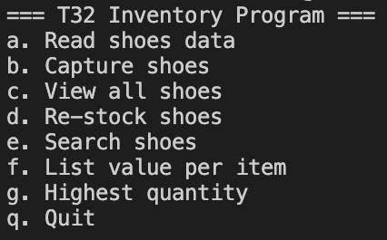
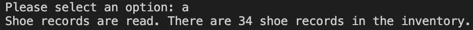
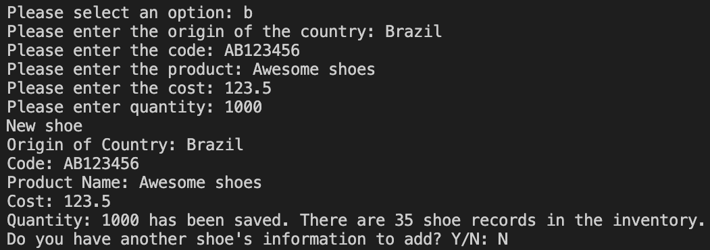
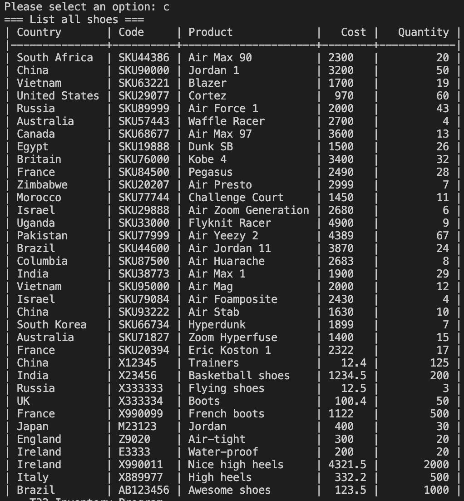
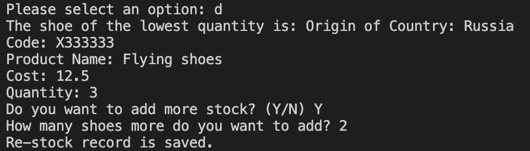
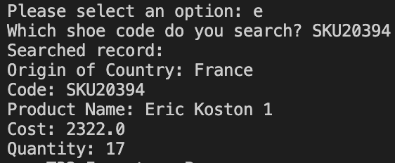
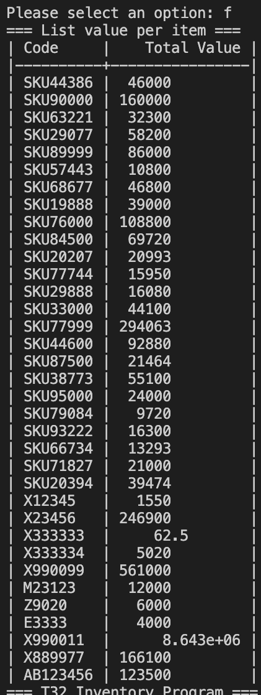
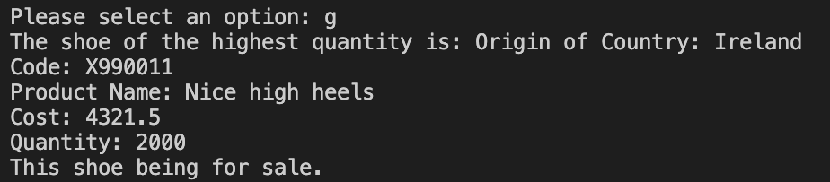

# Final Capstone

## Table of Contents
- [Project Name](#project_name)
- [Description](#description)
- [Installation](#installation)
- [Usage](#usage)
- [Credits](#credits)

## Project Name
Final Capstone

## Description
This is a Python program `inventory.py` to manage inventory of shoes for a company.
The program allows read shoe inventory data from users' input.
It also reads from and write to an external file called `inventory.txt`.
This project demonstrates my knowledge of Python and Object Oriented Programming.

## Installation
1. Download all files from this repository
2. Install `tabulate` module: `pip install tabulate`
3. Run the program: `python inventory.py`

## Usage
### Main Menu
A user can input a to g to select a function. They can input q to quit the program.

### Read shoes data
The program reads the file `inventory.txt`. It will save the records into the memory. The screen will shows the number of records read.

### Capture shoes
The program asks a user to input a new shoe's information including Origin of Country, Code, Product Name, Cost and Quantity.
Then the new record will be saved into the file `inventory.txt` as well as the memory.
A user will be asked to continue another shoe if they select Y, or back to Main Menu if they select N.

### View all shoes
The program lists all shoes recorded in a table format.

### Re-stock shoes
The program finds the shoe with the least quantity and asks a user if they want to add more.
If the user selects Y, then they will input additional quantity.
The revised quantity will be saved into the file `inventory.txt` as well as the memory.

### Search shoes
The program searches a shoe with Code inputted by a user. The information of the searched shoe will be displayed.

### List value per item
The program lists all shoes with their value per item. Value per item = Cost x Quantity.

### Highest Quantity
The program finds the shoe with the highest quantity and display its information. It also reminds a user the shoe being for sale.

## Credits
[Belle Yan](https://github.com/belleyan19)
